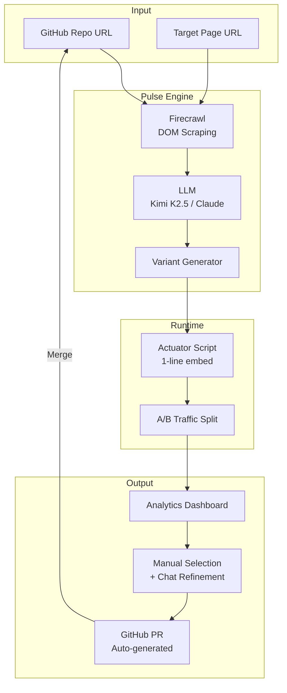

<div align="center">

# Pulse


### AI-Powered UX Optimization

**Scan. Generate. Test. Ship.**

[Demo](https://pulse.dev) · [Documentation](https://docs.pulse.dev) · [Report Bug](https://github.com/shlawg/pulse/issues)

</div>

---

## What is Pulse?

Pulse is an autonomous agent that fixes your UX conversion leaks.

Instead of just telling you what's wrong, Pulse **generates code** to fix it. It runs A/B tests on your live site using a lightweight script, collects data, and winning variants are automatically converted into GitHub Pull Requests.

> **"It's like having a senior frontend engineer and a data scientist working 24/7."**

## How It Works



## Features

- **Generative UI**: AI writes production-ready React/HTML code to improve your components
- **Zero-Config Deployment**: Single `<script>` tag—no CI/CD setup required for experiments
- **Auto-Pilot Testing**: Traffic allocation, statistical significance, and rollback handled automatically
- **One-Click PRs**: Winning variants are automatically converted into GitHub Pull Requests

## Tech Stack

| Component         | Technology                      | Purpose                                        |
| ----------------- | ------------------------------- | ---------------------------------------------- |
| **Frontend**      | Next.js 16, React 19, shadcn/ui | Dashboard for experiment management            |
| **Backend**       | FastAPI, Python 3.12            | API server, experiment orchestration           |
| **Database**      | MongoDB Atlas                   | Experiment configs, variant storage, analytics |
| **AI Engine**     | OpenRouter (Kimi K2.5)          | Variant generation from DOM analysis           |
| **Scraping**      | Firecrawl                       | Live DOM extraction from target sites          |
| **Notifications** | Resend                          | Email alerts for experiment results            |

## Quick Start

### Prerequisites

- Node.js 20+
- Python 3.12+
- Bun

### Installation

```bash
# 1. Clone the repo
git clone https://github.com/shlawg/pulse.git
cd pulse

# 2. Install dependencies
bun install
cd apps/api && pip install -r requirements.txt

# 3. Set up environment
cp .env.example .env

# 4. Run locally
bun dev
```

## License

This project is licensed under the MIT License - see the [LICENSE](LICENSE) file for details.
