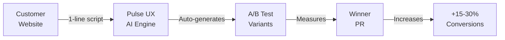

# Pulse UX Optimizer

AI-powered UX optimization platform with automated A/B testing.

## Overview

Pulse UX Optimizer enables developers and product teams to:

1. **Generate UX variants** using LLM (Kimi K2.5 via OpenRouter), informed by live DOM scraping via Firecrawl
2. **Deploy runtime experiments** without code deployments using an injected "actuator" script
3. **Record user sessions** automatically via rrweb for qualitative analysis
4. **Compare variants side-by-side** with visual diff rendering and AI-generated insights
5. **Watch session replays** to understand user behavior per variant
6. **Choose winning variants** through an intuitive dashboard interface
7. **Generate Pull Requests** automatically to codify the winning variant into the codebase

## How It Works



**Zero-code. AI-powered. Measurable ROI.**

## Tech Stack

### Frontend

- Next.js 16 with App Router
- React 19
- shadcn/ui + Tailwind CSS 4
- Zustand + TanStack Query

### Backend

- FastAPI (Python 3.12)
- MongoDB Atlas + Beanie ODM
- Redis for caching and job queues
- uv package manager

### External Services

- Firecrawl (DOM scraping)
- OpenRouter (LLM - Kimi K2.5)
- Resend (email notifications)
- GitHub API (PR creation)
- rrweb (session recording & replay)

## Project Structure

```
pulse-ux/
├── apps/
│   ├── web/                 # Next.js 16 frontend
│   └── api/                 # FastAPI backend
├── packages/
│   ├── actuator/            # Injector script for customer sites
│   └── shared/              # Shared TypeScript types
└── .github/workflows/       # CI/CD pipelines
```

## Getting Started

### Prerequisites

- Bun >= 1.1.0
- Python >= 3.12
- uv (Python package manager)
- MongoDB Atlas account
- Redis instance

### Installation

```bash
# Install frontend dependencies
bun install

# Install backend dependencies
cd apps/api && uv sync
```

### Development

```bash
# Run both frontend and backend
bun run dev

# Or run separately
bun run dev:web    # Frontend on http://localhost:3000
bun run dev:api    # Backend on http://localhost:8000
```

### Environment Variables

See `.env.example` files in each app directory.

## License

Private - All rights reserved
