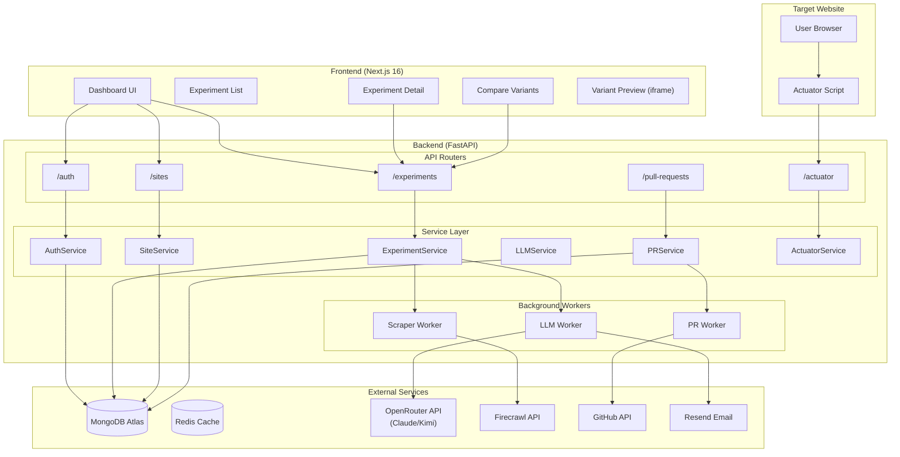
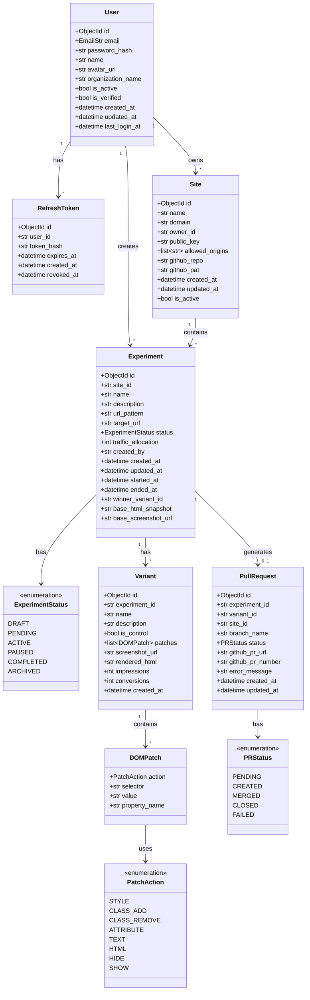
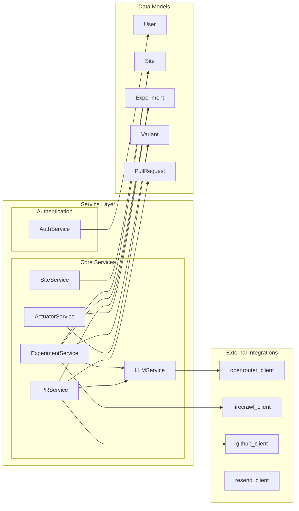
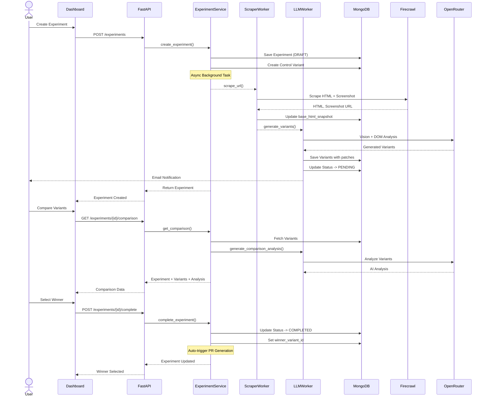
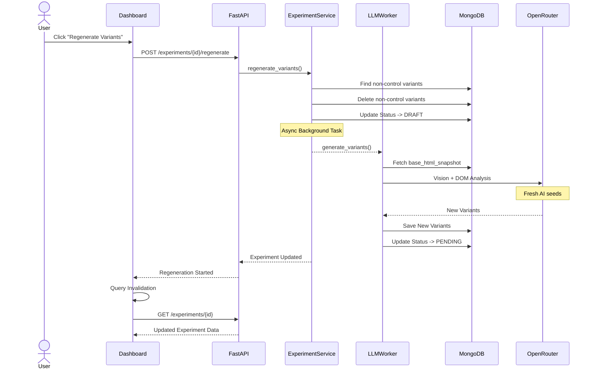
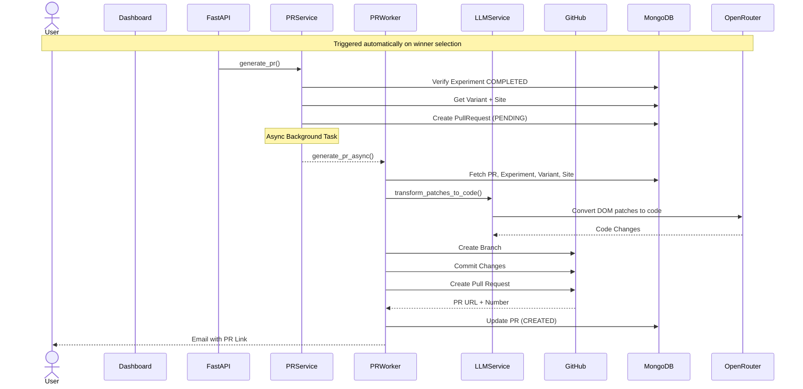
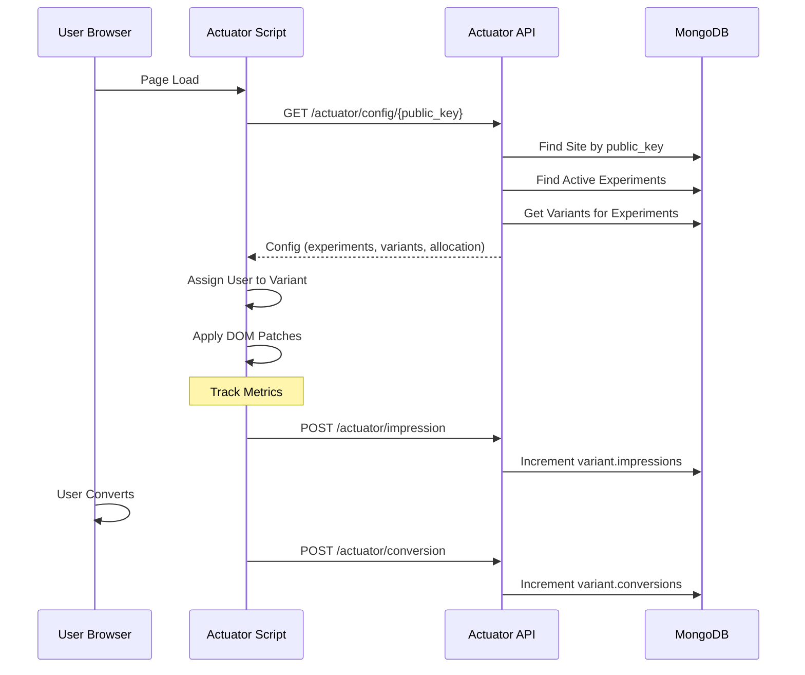

# Pulse UX Optimizer - Architecture Diagrams

This document provides comprehensive UML diagrams visualizing the architecture of the Pulse UX Optimizer platform.

---

## 1. System Overview - Component Diagram



---

## 2. Data Model - Class Diagram



---

## 3. Service Layer - Component Diagram



---

## 4. Experiment Lifecycle - Sequence Diagram



---

## 5. Variant Regeneration - Sequence Diagram



---

## 6. PR Generation - Sequence Diagram



---

## 7. Actuator Script Flow - Sequence Diagram



---

## 8. Technology Stack

| Layer                | Technology                                                                 |
| -------------------- | -------------------------------------------------------------------------- |
| **Frontend**         | Next.js 16, React 19, Tailwind CSS 4.x, shadcn/ui, Zustand, TanStack Query |
| **Backend**          | FastAPI 0.115.x, Python 3.13.x, Beanie 2.x (MongoDB ODM)                   |
| **Database**         | MongoDB Atlas                                                              |
| **Cache/Queue**      | Redis + ARQ                                                                |
| **LLM**              | Claude Opus 4.5 / Moonshot Kimi-k2.5 via OpenRouter                        |
| **Scraping**         | Firecrawl API                                                              |
| **Email**            | Resend                                                                     |
| **Version Control**  | GitHub API                                                                 |
| **Package Managers** | Bun (frontend), uv (backend)                                               |

---

## 9. Directory Structure

```
pulse-ux/
├── apps/
│   ├── api/                     # FastAPI Backend
│   │   └── src/
│   │       ├── config.py        # Settings & Environment
│   │       ├── database.py      # MongoDB Connection
│   │       ├── dependencies.py  # FastAPI Dependencies
│   │       ├── main.py          # Application Entry
│   │       ├── integrations/    # External API Clients
│   │       │   ├── firecrawl.py
│   │       │   ├── github.py
│   │       │   ├── openrouter.py
│   │       │   └── resend.py
│   │       ├── models/          # Beanie Documents
│   │       │   ├── experiment.py
│   │       │   ├── site.py
│   │       │   ├── user.py
│   │       │   ├── variant.py
│   │       │   └── pull_request.py
│   │       ├── routers/         # API Endpoints
│   │       │   ├── auth.py
│   │       │   ├── experiments.py
│   │       │   ├── sites.py
│   │       │   ├── actuator.py
│   │       │   └── pull_requests.py
│   │       ├── services/        # Business Logic
│   │       │   ├── auth_service.py
│   │       │   ├── experiment_service.py
│   │       │   ├── llm_service.py
│   │       │   ├── pr_service.py
│   │       │   └── site_service.py
│   │       └── workers/         # Background Tasks
│   │           ├── llm_worker.py
│   │           ├── pr_worker.py
│   │           └── scraper_worker.py
│   │
│   └── web/                     # Next.js Frontend
│       └── src/
│           ├── app/
│           │   ├── (auth)/      # Login/Register
│           │   ├── (dashboard)/ # Main Dashboard
│           │   │   └── experiments/
│           │   │       └── [experimentId]/
│           │   │           ├── page.tsx      # Detail View
│           │   │           └── compare/
│           │   │               └── page.tsx  # Comparison View
│           │   └── (marketing)/ # Landing Pages
│           ├── components/      # Reusable Components
│           └── types/           # TypeScript Interfaces
```

---

## 10. Key Features Summary

1. **LLM-Powered Variant Generation** - Uses multimodal vision (screenshot + DOM) to generate intelligent UX improvements
2. **Interactive Component Protection** - LLM instructions explicitly preserve dropdowns, accordions, and interactive elements
3. **Regenerate Variants** - Ability to regenerate unsatisfactory variants with fresh AI seeds
4. **Rendered HTML Persistence** - Cached HTML snapshots stored in MongoDB for fast preview loading
5. **Auto-PR on Winner Selection** - Automatically triggers GitHub PR creation when experiment completes
6. **Actuator Script** - Lightweight JS for runtime DOM patching without code deployment
7. **Email Notifications** - Automated emails when variants are ready via Resend
